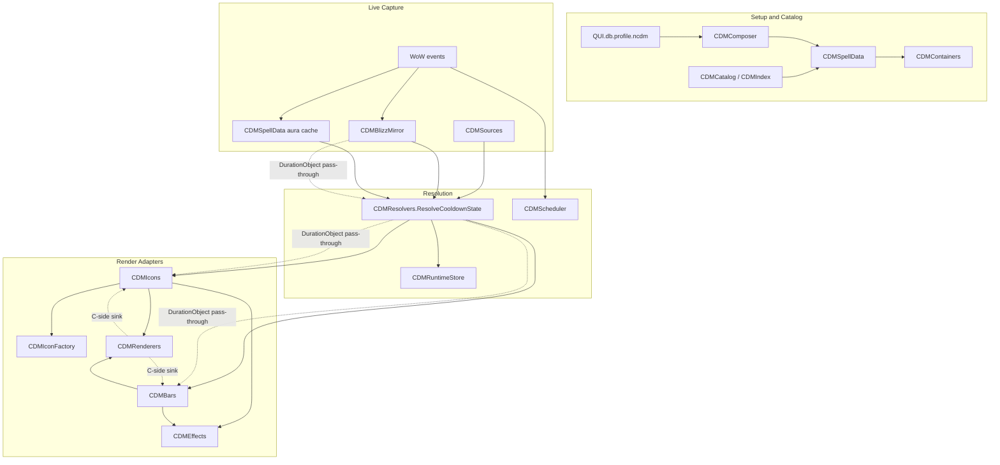

# CDM Data Pipeline

This is the maintainer reference for Cooldown Manager runtime data flow. Read it before changing CDM resolution, mirror capture, aura capture, icon cooldowns, bar timers, or secret-value handling.

CDM has one core rule: raw Blizzard timing and aura facts are resolved once, then icon and bar renderers adapt the resolved facts to their own widgets. Renderers may choose presentation, but they should not independently re-decide the duration lane from raw cooldown, aura, charge, or mirror payloads.

## Load Order

CDM files are loaded by `modules/cdm/cdm.xml` in this relevant order:

1. `cdm_shared.lua`
2. `hud_visibility.lua`
3. `cdm_index.lua`
4. `cdm_catalog.lua`
5. `cdm_runtime_store.lua`
6. `cdm_scheduler.lua`
7. `cdm_sources.lua`
8. `cdm_renderers.lua`
9. `cdm_spelldata.lua`
10. `cdm_blizz_mirror.lua`
11. `cdm_resolvers.lua`
12. `cdm_icon_factory.lua`
13. `cdm_icons.lua`
14. `cdm_bars.lua`
15. `cdm_containers.lua`
16. `cdm_composer.lua`
17. `cdm_effects.lua`

The order matters because `CDMResolvers` depends on source, aura, mirror, and runtime-store modules, while icon and bar renderers depend on the resolver.

## Pipeline



Legend:

- Solid arrows are regular Lua facts or control flow.
- Dotted arrows are `DurationObject` flow. The object is passed through; Lua code must not inspect timing fields from it.
- `CDMResolvers.ResolveCooldownState` is the factual interface for one entry's current runtime state.
- `CDMRenderers` is the frame-write facade. Resolver and source modules should not write cooldown frames.

## Module Ownership

| Module | Owns | Should Not Own |
| --- | --- | --- |
| `CDMSources` | Small wrappers around spell, item, cooldown, charge, and aura queries. | Duration lane policy or renderer policy. |
| `CDMIndex` | Blizzard Cooldown Viewer catalog invalidation and base/override spell lookup helpers. | Icon/bar rendering decisions. |
| `CDMCatalog` | Available-spell catalog and Blizzard seed data for composer flows. | Runtime activity or duration selection. |
| `CDMSpellData` | Owned entry lists, aura capture, aura resolution, dormant spell reconciliation, display identity. | Icon cooldown binding or bar timer rendering. |
| `CDMBlizzMirror` | Hidden Blizzard viewer child capture, sanitized Cooldown Viewer info, child `DurationObject` capture, source hints, active/visibility facts, and mirror epoch. | Final duration lane or activity policy for addon-owned frames. |
| `CDMResolvers` | Resolved cooldown state: lane, activity, source identity, mirror backing, aura facts, count facts, item timing. | Desaturation, GCD visual style, text placement, layout, glow. |
| `CDMRuntimeStore` | Last resolved state snapshot per icon/bar entry. | Fresh Blizzard queries or lane decisions. |
| `CDMScheduler` | Coalesced runtime updates and event fan-out control. | Resolution policy. |
| `CDMIconFactory` | Icon pool lifecycle and mirror child binding retries. | Icon runtime updates, resolved-state application, runtime activity synthesis, raw cooldown lane decision logic, or entry classification for stack text. |
| `CDMIcons` | Icon runtime update interface and renderer policy: cooldown binding, GCD styling, desaturation, range/usability, stack text, mirror-bind stack seeding, targeted refresh. | Independent raw duration lane resolution. |
| `CDMBars` | Bar renderer policy: StatusBar fill, timer text, icon texture, inactive presentation, layout behavior. | Independent raw duration lane resolution for non-inventory entries. |
| `CDMRenderers` | Cooldown and StatusBar frame writes. | Blizzard data lookup or resolution policy. |
| `CDMContainers` | Container frames, layout, profile/loadout save and refresh orchestration. | Entry runtime activity facts. |
| `CDMEffects` | Glow, swipe, overlay, and highlight presentation. | Runtime lane selection. |

## Resolved Cooldown State

`CDMResolvers.ResolveCooldownState(context)` resolves one entry from an explicit context:

```lua
{
    entry = entry,
    runtimeSpellID = spellID,
    mirrorCooldownID = cooldownID,
    mirrorCategory = category,
    containerKey = containerKey,
    totemSlot = totemSlot,
    useBuffSwipe = true,
    skipAuraPhase = false,
    priorCooldownActive = false,
    priorRealCooldownActive = false,
    priorShowingRealCooldownSwipe = false,
    priorResolvedCooldownMode = "cooldown",
    preservedRealDurObj = durObj,
    preservedRealMode = "cooldown",
    preservedRealSourceID = sourceID,
    lastChargeMirrorCooldownID = cooldownID,
    lastChargeMirrorCategory = category,
    lastChargeRuntimeSpellID = spellID,
}
```

The returned state is a flat table of named facts. Important fields include:

- `mode`: `aura`, `charge`, `cooldown`, `gcd-only`, `item-cooldown`, or `inactive`.
- `active` / `isActive`: whether the selected lane is active.
- `durObj`: renderable `DurationObject` when available.
- `start` / `duration`: clean numeric timing for the item-cooldown path.
- `sourceID`: source identity for dedupe and debug.
- `spellID`: resolved runtime spell identity.
- `isOnCooldown`, `rechargeActive`, `hasCharges`, `hasChargesRemaining`, `gcdOnly`: final activity facts for visibility, desaturation, and custom bar policy.
- `numericCooldownActive`: whether the item numeric fallback is active and safe to render.
- `cooldownInfo`, `cooldownInfoActive`, `cooldownInfoOnGCD`: consume-immediately cooldown API facts already read by the resolver.
- `mirrorBacked`, `mirrorCooldownID`, `mirrorCategory`, `mirrorState`: mirror backing facts.
- `auraActive`, `auraInstanceID`, `auraUnit`, `auraData`, `resolvedAuraSpellID`: aura facts.
- `hasExpirationTime`, `hideDurationText`, `durationStateUnknown`: expiration facts.
- `countValue`, `countSinkText`, `countShown`, `countSource`, `countMirrorBacked`: count facts.
- `totemSlot`, `totemName`, `totemIcon`, `isTotemInstance`: totem facts.

Callers should consume fields immediately. Hot paths may reuse scratch tables internally.

`CDMResolvers.BuildCooldownStateContext(owner, entry, runtimeSpellID, options)` is the shared context builder for icon and bar runtime adapters. It owns the resolver-context shape, mirror identity policy, fallback mirror binding, container key, totem slot, prior cooldown memory facts, and renderer-policy flags before `ResolveCooldownState` runs. Renderer modules should pass named options into this builder instead of hand-assembling context tables.

## Container Taxonomy

CDM keeps these terms separate:

- `containerKey`: QUI saved-data and layout identity.
- `containerType`: legacy persisted entry family: `cooldown`, `aura`, or `auraBar`.
- `containerShape`: renderer shape: `icon` or `bar`.
- `mirrorCategory`: Blizzard Cooldown Viewer category: `essential`, `utility`, `buff`, or `trackedBar`.
- `entry.kind`: runtime entry meaning: `cooldown` or `aura`.

`CDMShared` owns built-in container constants and mirror-category predicates. Callers should not treat `viewerType` as all of these at once; resolve the specific fact they need.

## Mirror Identity

`CDMResolvers.ResolveBlizzardMirrorIdentityState(entry)` is the named identity interface for Blizzard Cooldown Viewer bindings. It returns a consume-immediately table when an entry can safely bind to a mirror child:

- `cooldownID`: accepted Blizzard Cooldown Viewer cooldown ID.
- `category`: accepted native category: `essential`, `utility`, `buff`, or `trackedBar`.
- `state`: sanitized mirror state from `CDMBlizzMirror`.
- `viewerCategory`: normalized category requested by the entry, when the entry has one.
- `strictAuraBinding`: whether the entry must stay on aura-style mirror categories.
- `source`: `entry` for ID-derived lookup or `entry-cooldownID` for an explicit entry binding.
- `entryType`: safe entry type used for validation.

Mirror identity is intentionally exposed only through the named state interface so stale explicit bindings, aura-vs-cooldown category rejection, and mirror state ownership stay centralized.

## Mirror Authority

`CDMBlizzMirror` is the capture adapter for Blizzard viewer children. It provides sanitized mirror facts to `CDMResolvers`, including child `DurationObject` values, source hints, active/visibility state, identity, epoch, aura/count/totem facts, and sanitized Cooldown Viewer metadata.

`CDMResolvers.ResolveCooldownState` is the final authority for addon-owned runtime state. It decides whether a mirror-backed state is accepted, treated as GCD-only for cooldown activity side effects, or rejected as inactive when clean live cooldown facts prove the mirror stale. If live cooldown facts are absent or unknown, an active mirror `DurationObject` can still be the best renderable timing fact. Icon and bar renderers must consume the resolved state and must not repeat this mirror-vs-live adjudication.

## DurationObject Rules

`DurationObject` values are the preferred timing carrier for CDM cooldown and aura display.

Allowed:

- Pass a `DurationObject` directly to `Cooldown:SetCooldownFromDurationObject`.
- Pass a `DurationObject` directly to `StatusBar:SetTimerDuration`.
- Store the `DurationObject` as a value for later pass-through.
- Compare userdata identity only when the comparison is used as a wrapper-refresh signal, not as timing logic.

Not allowed:

- Read or infer Lua timing facts from a `DurationObject`.
- Use a `DurationObject` as a table key.
- Convert it to numeric timing.
- Branch on secret return values from its methods.

When code needs to decide whether a secret boolean is true or false, use the CurveUtil path described below or treat the value as unknown.

## Cooldown Frame Writes

Secret-safe cooldown frame write:

- `SetCooldownFromDurationObject`

Unsafe from tainted addon code when arguments may be secret:

- `SetCooldown`
- `SetCooldownFromExpirationTime`
- `SetCooldownDuration`
- `SetCooldownUNIX`

`CDMRenderers.ApplyNumericCooldown` exists for the clean numeric item fallback. That path should stay narrow: only use it when start and duration have already been proven ordinary Lua numbers and the value is not derived from a secret cooldown payload.

For bars, `StatusBar:SetTimerDuration` is the preferred fill path when a `DurationObject` is available. Numeric StatusBar values are only safe when the numbers are clean and not secret-derived.

## Secret Values

WoW 12.x can return secret values from many cooldown, aura, unit, and Cooldown Viewer calls during restricted states. Lua must not compare, sort, concatenate, format, or branch on a value that may be secret.

Safe patterns:

- Detect secrets before using Lua operators: `IsSecretValue(value)` or `HasSecretValue(...)`.
- Pass a secret value directly to a known C-side sink that accepts it.
- Decode secret booleans through `C_CurveUtil.EvaluateColorValueFromBoolean(secretBool, 1, 0)`.
- Treat the result as unknown when detection or decoding is unavailable.

Unsafe patterns:

- `if secretValue then`
- `secretValue == true`
- `secretValue ~= nil`
- `secretValue > 0`
- `tostring(secretValue)` for display or keys
- `table.sort` predicates that touch possible secret values
- helper unwrapping as the primary strategy for a value that may be secret

`CDMBlizzMirror` sanitizes Cooldown Viewer info at capture time so later code can compare stored mirror identity fields. If a raw field is secret and cannot be decoded safely, it is stored as unknown rather than forcing a Lua value.

## Local Blizzard Reference

Use local sources first:

- `tests/api-docs/blizzard/`: vendored Blizzard API documentation tables from FrameXML.
- `tests/api-docs/api-index.lua`: generated index used by the taint analyzer.
- `tests/api-docs/cdm_blizzard_reference.lua`: CDM-specific policy table for DurationObject sources/sinks, unsafe cooldown setters, and secret boolean decode.
- `docs/blizzard/cdm-api-reference.md`: maintainer-facing explanation of the same CDM Blizzard API facts.
- `tools/test_taint.lua`: CLI for taint analyzer checks and index refresh.
- `tests/taint/`: analyzer, registry, parser, config, fixtures, and self-tests.

Refresh command after replacing vendored Blizzard docs:

```powershell
lua tools\test_taint.lua --update-index
```

Baseline checks:

```powershell
lua tools\test_taint.lua --self-test
lua tools\test_taint.lua --no-color --only "modules/cdm" .
```

## Debugging Checklist

Entry missing from UI:

- Check `CDMComposer` entry list state.
- Check `CDMSpellData:GetSpellList(containerKey)`.
- Check `CDMContainers.LayoutContainer(containerKey)`.
- Check icon pool creation in `CDMIconFactory` / `CDMIcons`.
- For bars, check `CDMBars:BuildBarsFromOwned`.

Wrong duration lane:

- Inspect `CDMResolvers.ResolveCooldownState(context)`.
- Check `state.mode`, `state.sourceID`, `state.durObj`, `state.mirrorBacked`.
- Check mirror identity through `CDMResolvers.ResolveBlizzardMirrorIdentityState(entry)`.
- Check charge facts and GCD fallback only inside resolver paths.

Icons and bars disagree:

- Compare resolver contexts: `entry`, `runtimeSpellID`, `mirrorCooldownID`, `mirrorCategory`, `containerKey`, `totemSlot`.
- Compare `CDMRuntimeStore` icon/bar snapshots.
- Confirm the divergence is renderer policy, not lane resolution.

Aura active but no swipe:

- Check `CDMSpellData:ResolveAuraState(params)`.
- Check `auraActive`, `hasExpirationTime`, `hideDurationText`, and `durationStateUnknown`.
- Check whether a mirror-backed aura has a `DurationObject`.
- Check `useBuffSwipe` and `skipAuraPhase`.

Cooldown desaturation persists:

- Check resolved `mode`.
- Check `active` / `isActive`.
- Check icon `_resolvedCooldownMode` and runtime-store state.
- Check whether a mirror-backed cooldown was rejected by live cooldown authority.

Stack/count mismatch:

- Check `countShown`, `countValue`, `countSinkText`, `countSource`, and `countMirrorBacked`.
- Mirror-backed count text should flow from resolved state to renderer text sinks without independent synthesis.

Stale mirror state:

- Check `CDMIndex` invalidation.
- Check `CDMBlizzMirror.ForceRescan`.
- Check `CDMBlizzMirror.GetStateByCooldownID(cooldownID, category)`.
- Check whether explicit icon/bar mirror identity was rejected and replaced by resolved identity.

## Verification

Use these commands after changing this area:

```powershell
rg -n "ResolveIconDurationObject|ResolveAuraStateForIcon|HasRealCooldownState|BuildBarAuraResultFromMirrorPayload|BuildSpellCooldownBarResult" modules/cdm tests -g "*.lua"
rg -n "SetCooldown\(|SetCooldownFromExpirationTime\(|SetCooldownDuration\(|SetCooldownUNIX\(" modules/cdm core -g "*.lua"
lua tests\cdm_resolvers_cooldown_state_test.lua
Get-ChildItem -LiteralPath tests -Filter "cdm*.lua" | Sort-Object Name | ForEach-Object { lua $_.FullName }
lua tools\test_taint.lua --self-test
lua tools\test_taint.lua --no-color --only "modules/cdm" .
```

The first `rg` command should produce no matches. The second command should be reviewed manually: CDM cooldown display should prefer `SetCooldownFromDurationObject`; any numeric cooldown write must prove its inputs are clean.
